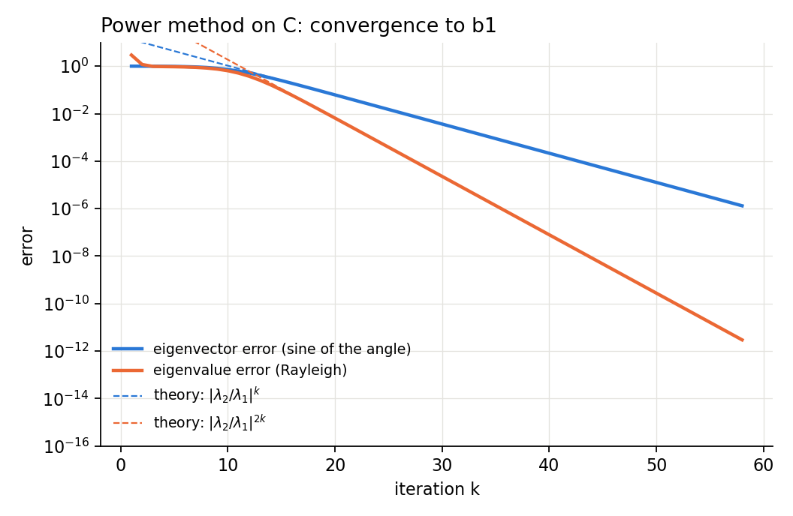
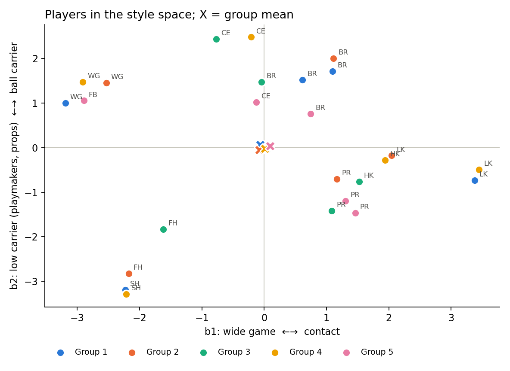
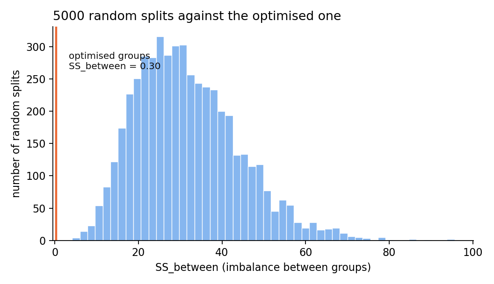
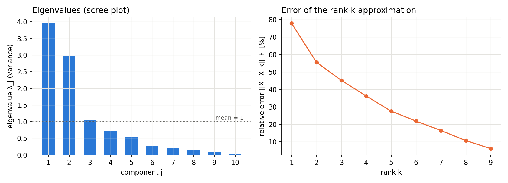
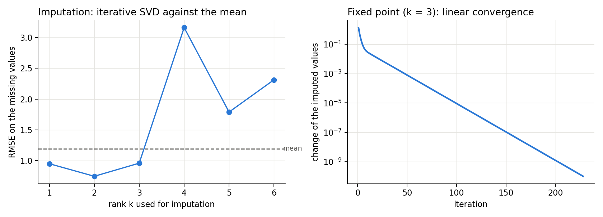
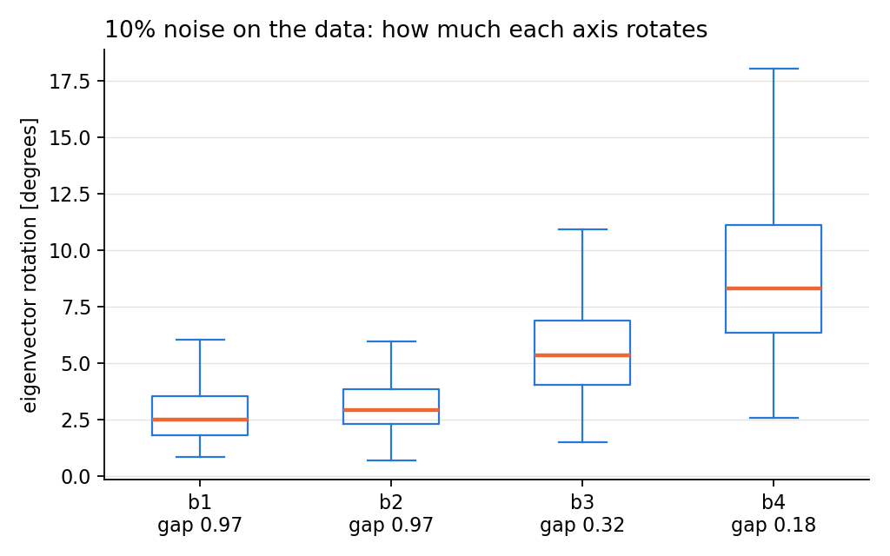

# Playing styles and balanced training groups (PCA + power method)

Numerical Analysis project. A rugby squad of 25 players is described by 10 statistics per 80 minutes.

**Questions**
1. How many "playing-style axes" are enough to describe the players, and which are they?
2. How can the squad be split into balanced training groups, where players strong on an axis train with players who are weak on it?

> The data are **synthetic** (`synthetic_data.py`): mean profiles per role plus noise.

## Method

| Step | What | Numerical tool |
|---|---|---|
| 1 | Standardisation, covariance matrix C = XᵀX/(N−1) | — |
| 2 | Principal components: max bᵀCb with ‖b‖=1 ⇒ Cb = λb | Lagrangian |
| 3 | Computing the components | **power method** + Rayleigh + **deflation**, checked against the **SVD** |
| 4 | Balanced groups: min SS_between (⇔ max SS_within) | variance decomposition + pairwise swaps |
| 5 | Work directions: weak axis relative to the player's role, statistics to train, mentor | — |
| 6 | Acceleration: shift, shifted inverse power method | **LU** factorisation once, then substitutions |
| 7 | Reliability of the axes: rotation of the eigenvectors with perturbed data | conditioning and eigenvalue gap |
| 8 | Rank-k approximation and missing data | **Eckart–Young**, imputation with iterative SVD (**fixed point**) |

The full derivation is in `theory.tex`. Theoretical reference: Deisenroth, Faisal, Ong, *Mathematics for Machine Learning* (2020), ch. 6 and 10.

## Main results

- **Axes**: b₁ = contact ↔ wide game, b₂ = ball carrier ↔ low carrier. The first 3 components explain 79.6% of the variance.
- **Power method**: eigenvalues equal to those of the SVD; measured convergence factor 0.760 against the theoretical |λ₂/λ₁| = 0.754. After deflation b₂ converges in 16 iterations (λ₃/λ₂ = 0.35), b₁ in 58 (λ₂/λ₁ = 0.75).
- **Groups**: SS_between = 0.30 out of SS_tot = 191.1 (0.16%). Over 5000 random splits: mean 31.7, best 4.2.
- **Work directions**: 5 players flagged (Lock 1 on b₁; Back row 4, Centre 3, Prop 3, Fly-half 1 on b₂), each with a mentor from their own group.
- **Shift**: with σ* = (λ₂+λ_D)/2 the iterations for b₁ drop from 47 to 29; with the inverse power method (σ close to λⱼ) 5–9 iterations are enough.
- **Conditioning**: power method and inverse power method (σ = 0) give K(C) = λ_max/λ_min = 108.4 = K(X)², with K(X) = 10.4 from the SVD.
- **Reliability**: with 10% noise b₁ and b₂ rotate by about 2.5–3°, b₄ by 8° (gap 0.18): only the first two axes are interpreted.
- **Missing data**: rank-2 imputation reduces the error by 37% compared with the mean; with too high a rank the fixed point does not converge.

| Power method convergence | Groups in the style space | Against random splits |
| --- | --- | --- |
|  |  |  |

| Rank k | Missing data | Sensitivity |
| --- | --- | --- |
|  |  |  |

## Usage

```bash
pip install -r requirements.txt
python block1_pca_svd.py              # covariance, SVD, explained variance, axis weights
python block2_power_method.py         # power method + deflation, convergence plot
python block3_groups.py               # balanced groups, comparison with chance, work directions
python block4_rank_imputation.py      # Eckart-Young, imputation of missing data
python block5_shift_sensitivity.py    # shift, inverse power method (LU), sensitivity to noise
```

The expected output of each block is in `output_block1.txt` … `output_block5.txt`.

## Limitations

- Synthetic data and N = 25: the components beyond the second are not very reliable (λ₃ and λ₄ are close).
- The swap algorithm finds a **local minimum**, it does not guarantee the global optimum (30 random starts).
- PCA describes **styles, not levels**: for the work directions each player is compared with the mean of their role.

## Further work

Real data from a whole league: axes estimated on hundreds of players, groups formed inside one team. For large N, compute Cv = Xᵀ(Xv)/(N−1) without forming C. For the work directions: monitoring over time with frozen axes, uncertainty on the deficits, mentor-aware groups (see `theory.tex`, Section "Work directions").
## Italian version 
[Versione italiana](italiano/) 

